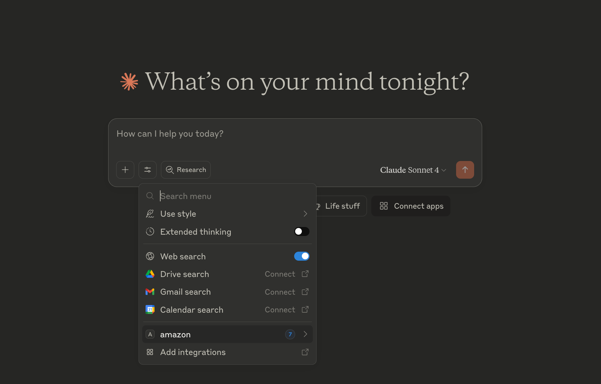

# Amazon MCP Server

This server allows you to interact with Amazon's services using the MCP (Model Context Protocol) framework. This lets you use your Amazon account through ChatGPT or Claude AI interfaces.

## Features

- **Product search**: Search for products on Amazon TODO
- **Orders history**: Retrieve your recent Amazon orders details
- **Account management**: Manage your Amazon account settings TODO
- **Cart management**: Add or remove items from your Amazon cart TODO
- **Ordering**: Place orders TODO

## Install

Install dependencies

```sh
npm install -D
```

Build the project

```sh
npm run build
```

## Claude Desktop Integration

Update [~/Library/Application Support/Claude/claude_desktop_config.json](~/Library/Application%20Support/Claude/claude_desktop_config.json) with the path to the MCP server.

```json
{
  "mcpServers": {
    "amazon": {
      "command": "node",
      "args": ["/Users/admin/dev/mcp-server-amazon/build/index.js"]
    }
  }
}
```

Restart the Claude Desktop app to apply the changes. You should now see the Amazon MCP server listed in the Claude Desktop app.



## License

This is an experimental project and is not affiliated with Amazon. Use at your own risk.

For now, this project is distributed under a private license. You are not permitted to use, copy, distribute, or modify this software without explicit permission from the author.
