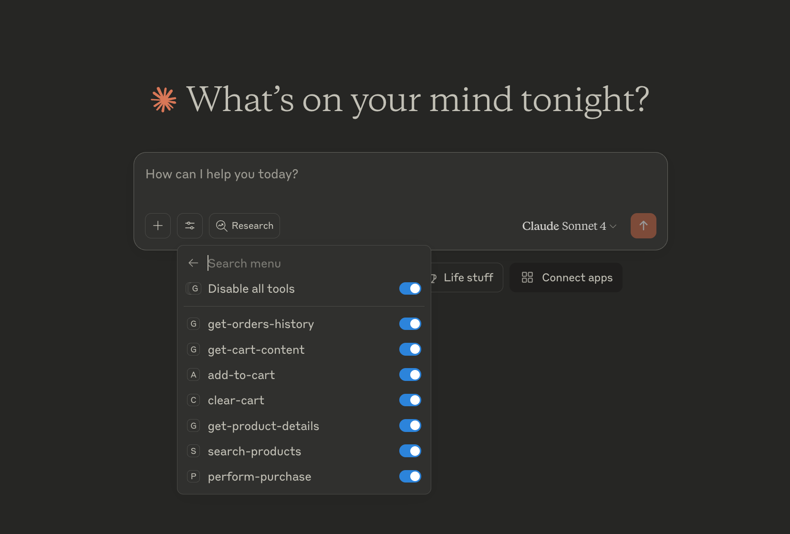

# Amazon MCP Server

This server allows you to interact with Amazon's services using the MCP (Model Context Protocol) framework. This lets you use your Amazon account through ChatGPT or Claude AI interfaces.

## Features

- **Product search**: Search for products on Amazon
- **Product details**: Retrieve detailed information about a specific product on Amazon
- **Cart management**: Add items or clear your Amazon cart
- **Ordering**: Place orders (fake for demonstration purposes)
- **Orders history**: Retrieve your recent Amazon orders details

## Demo

Simple demo, showcasing a quick product search and purchase.


## Full Demo

Another more complex demo with products search, leveraging Claude AI recommendations to compare and make a decision, then purchase.

It showcases how natural and powerful the Amazon MCP integration could be inside a conversation

Video: https://www.youtube.com/watch?v=xas2CLkJDYg

## Install

Install dependencies

```sh
npm install -D
```

Build the project

```sh
npm run build
```

## Claude Desktop Integration

Create or update `~/Library/Application Support/Claude/claude_desktop_config.json` with the path to the MCP server.

```json
{
  "mcpServers": {
    "amazon": {
      "command": "node",
      "args": ["/Users/admin/dev/mcp-server-amazon/build/index.js"]
    }
  }
}
```

Restart the Claude Desktop app to apply the changes. You should now see the Amazon MCP server listed in the Claude Desktop app.

|                                  |                                    |
| :------------------------------: | :--------------------------------: |
|  |  |

## Troubleshooting

The MCP server logs its output to a file. If you encounter any issues, you can check the log file for more information.

See `~/Library/Logs/Claude/mcp-server-amazon.log`

## License

This is an experimental project and is not affiliated with Amazon. Use at your own risk.

For now, this project is distributed under a private license. You are not permitted to use, copy, distribute, or modify this software without explicit permission from the author.
